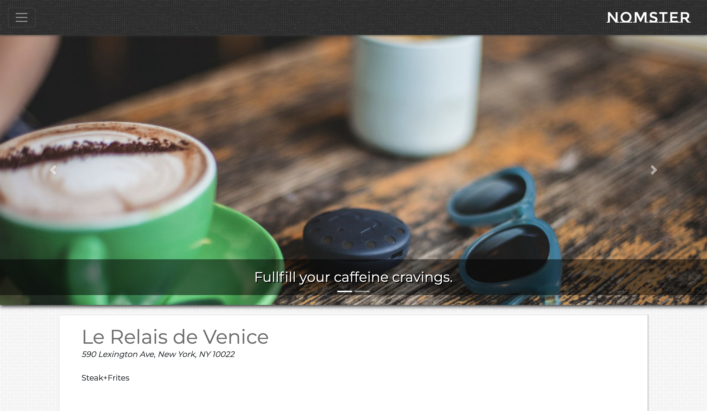

# Nomster - Yelp Clone

A Yelp clone that integrates with the Google Maps API and includes features like user comments, star ratings, image uploading, and user authentication.

Preview:
https://jpnomster.herokuapp.com

## Features
* [Ruby on Rails](https://guides.rubyonrails.org/) - The web framework used.
* Mobile-responsive.
* User Authentication: Devise gem.
* Picture Uploads: Carrierwave and MiniMagick gems.

## Authors
* **Jean-Pol Bacquet** - *Assignment from UCF Web Boot Camp* - [Nomster - Yelp Clone](https://github.com/jeanpolbac/nomster-jp-bacquet)

## Credits
* [UCF - Coding Bootcamp](https://bootcamp.ce.ucf.edu/coding/)
